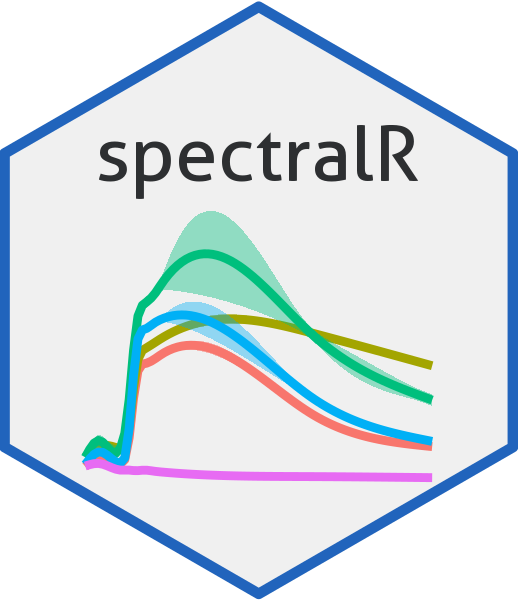

# spectralR 

### Spectral reflectance visualisations for user-defined areas

See our [vignette](https://olehprylutskyi.github.io/spectralR) for
detailed usage examples.

## Description

This package provides tools for obtaining, processing, and visualization
of satellite-derived spectral reflectance data for the user-defined
polygons of earth surface classes, allowing to explore visually in which
wavelengths the classes differ. Input should be a shapefile with
polygons of surface classes (it might be polygons of different habitat
types, crops, any other things). As a source of spectral reflectance
data we use **Sentinel2 L2A** satellite mission (only optical bands),
obtained through **Google Earth Engine** service.

The workflow depends on `rgee` R package, which provides a bridge
between **R** and **Python** API for **Google Earth Engine**. All the
operations with satellite images run in a cloud, and afterwards obtained
pixel data visualize locally. Therefore, despite of extent of input
data, the most resource hungry operations do not overload your local
machine. But that means that you need a stable Internet connection for
using API.

The overall workflow is following:

1.  Load user’s ESRI shapefile containing polygons for user-defined
    surface classes, as well as the text or numerical field with classes
    names (labels).

2.  Apply rgee functionality to retrieve multi-band pixel data for
    classes polygons from Google Earth Engine service.

3.  Visualize retrieved pixel data locally, mainly using ggplot2
    approach.

Essential requirements:

-   stable Internet connection (for using API)

-   Installed and correctly pre-configured Python environment (v. 3.5 or
    above)

-   valid Google Earth Engine account

## Installation

``` r
library(remotes)
install_github("olehprylutskyi/spectralR")
```

`spectralR` is strongly depends on `rgee` and `sf` packages, so install
and configure them before installing `spectralR`. More details in the
[vignette](https://olehprylutskyi.github.io/spectralR).

## Output examples


## References

Shyriaieva, D., Prylutskyi, O. (2021). Exploratory analysis of the
spectral reflectance curves of habitat types: a case study on Southern
Bug River valley, Ukraine. In: 63rd IAVS Annual Symposium: Book of
Abstracts, p. 153.
